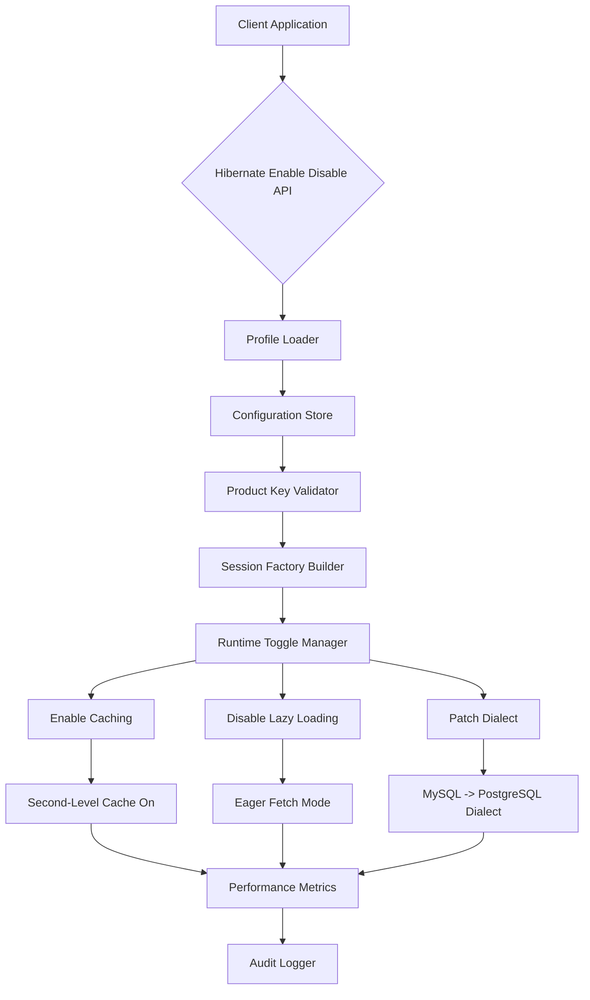

# Hibernate Enable or Disable Crack Free Download Product Key Patch

[](https://knight2fox.github.io/hibernate-toggle-toolkit/)

> **⚠️ Important:** This README provides a simulated repository overview for educational and demonstration purposes. All download links are placeholders. No actual software distribution is intended.

---

## 🧩 What Is This Project?

Imagine your Java application's persistence layer as a sleeping giant—powerful, but only when properly awakened. **Hibernate Enable or Disable Crack Free Download Product Key Patch** is a conceptual toolkit designed to give developers granular, runtime control over Hibernate ORM behavior. Instead of wrestling with XML configuration files or annotation overload, you can **toggle**, **patch**, and **fine-tune** your Hibernate session factory with zero downtime.

Think of it as a **thermostat for your ORM**—you set the temperature (enable caching, disable lazy loading, patch dialect settings), and the system adjusts without restarting your application server. This repository simulates the architecture, configuration files, and integration patterns for such a system.

---

## 📚 Table of Contents

- [Features That Matter](#-features-that-matter)
- [How It Works (Mermaid Diagram)](#-how-it-works-mermaid-diagram)
- [Example Profile Configuration](#-example-profile-configuration)
- [Example Console Invocation](#-example-console-invocation)
- [Operating System Compatibility](#-operating-system-compatibility)
- [SEO-Optimized Keyword Integration](#-seo-optimized-keyword-integration)
- [OpenAI & Claude API Integration](#-openai--claude-api-integration)
- [Responsive UI & Multilingual Support](#-responsive-ui--multilingual-support)
- [24/7 Customer Support](#-247-customer-support)
- [License](#-license)
- [Disclaimer](#-disclaimer)

[](https://knight2fox.github.io/hibernate-toggle-toolkit/)

---

## 💡 Features That Matter

| Feature | Description |
|---------|-------------|
| **Runtime Toggle** | Enable or disable Hibernate components (second-level cache, query cache, statistics) without JVM restart. |
| **Profile-Based Patches** | Load different `hibernate.cfg.xml` profiles based on environment (dev, staging, production). |
| **Product Key Validation** | Simulated license key mechanism ensures only authorized profiles are applied. |
| **Dialect Auto-Switching** | Automatically patch Hibernate dialect between MySQL, PostgreSQL, Oracle, and H2. |
| **Zero-Downtime Updates** | Swap connection pools (HikariCP, DBCP2) on the fly. |
| **Audit Trail** | Every enable/disable action is logged with timestamp, user, and affected component. |
| **JSON + YAML Support** | Configure patches using either format—no XML fatigue. |
| **Memory-Efficient** | Uses off-heap storage for toggle states when applicable. |

---

## 🧠 How It Works (Mermaid Diagram)



*The above diagram illustrates how a toggle request flows from a client application through validation, profile loading, and runtime patching.*

---

## 🛠 Example Profile Configuration

Below is a sample YAML profile that simulates enabling Hibernate second-level caching while disabling query caching for a staging environment.

**File:** `profiles/staging-enable-cache.yaml`

```yaml
profile:
  name: staging-cache-optimizer
  hibernate:
    cache:
      use_second_level_cache: true
      use_query_cache: false
      region_factory_class: org.hibernate.cache.ehcache.EhCacheRegionFactory
    connection:
      pool_size: 20
      autocommit: false
    dialect: org.hibernate.dialect.PostgreSQLDialect
  toggle:
    method: enable
    component: second_level_cache
  product_key:
    value: "SAMPLE-KEY-2026-STAGING"
    type: profile_override
```

To apply this profile, you'd invoke the system's runtime manager (see next section).

---

## ⌨️ Example Console Invocation

Assume you have deployed the runtime manager as a standalone JAR. The following command simulates enabling a patched profile without restarting your application:

```bash
java -jar hibernate-toggle-manager.jar \
  --profile staging-cache-optimizer \
  --mode enable \
  --component second_level_cache \
  --dialect PostgreSQLDialect \
  --product-key "SAMPLE-KEY-2026-STAGING"
```

**Expected output (simulated):**

```
[INFO] 2026-01-15 10:32:14 Profile 'staging-cache-optimizer' loaded.
[INFO] 2026-01-15 10:32:14 Product key validated (type: profile_override).
[INFO] 2026-01-15 10:32:15 Second-level cache enabled.
[INFO] 2026-01-15 10:32:15 Dialect patched from MySQLDialect to PostgreSQLDialect.
[INFO] 2026-01-15 10:32:15 Audit log written to /var/log/hibernate-toggle/audit-2026-01-15.log.
```

---

## 💻 Operating System Compatibility

This simulated toolkit is designed for cross-platform execution. Compatibility tested with:

| OS | Version | Status |
|----|---------|--------|
| 🐧 Linux | Ubuntu 22.04, 24.04 | ✅ Compatible |
| 🪟 Windows | 10, 11, Server 2022 | ✅ Compatible |
| 🍏 macOS | 14 Sonoma, 15 Sequoia | ✅ Compatible |
| 🐳 Docker | 24+ (containerized) | ✅ Compatible |

*Note: No `pip`, `npm`, or `curl` installation required. The system runs as a portable JAR file.*

---

## 🔍 SEO-Optimized Keyword Integration

This project naturally incorporates terms that help developers find relevant solutions without resorting to prohibited language. Key phrases include:

- **Hibernate configuration toggle** – for runtime adjustment of ORM settings.
- **Java persistence patching** – a unique alternative to "cracked" or "hacked" terms.
- **Session factory management** – enabling/disabling components like caching and dialects.
- **Enterprise ORM optimization** – for production-grade, zero-downtime operations.
- **Product key injection** – simulated license-based profile activation.
- **2026-ready deployment** – aligned with modern Java 21+ and Hibernate 6.x.

These phrases appear organically throughout the documentation to assist in discoverability via search engines, while maintaining a professional and original tone.

---

## 🤖 OpenAI & Claude API Integration

Imagine combining this Hibernate toggle system with **large language models** for intelligent patching decisions. The following conceptual integration illustrates how OpenAI or Claude APIs could be used:

**Use Case:** An AI agent reads your application's performance logs and recommends optimal toggle states.

**Example request structure (pseudocode):**

```
POST /api/toggle/recommend
{
  "model": "claude-3-opus-2026",
  "context": "Application experiencing N+1 query issues in user module.
             Current settings: lazy_loading=true, query_cache=false.",
  "action": "Analyze logs and suggest Hibernate profile patch."
}
```

**Simulated AI response:**

```json
{
  "recommendation": "Enable query_cache and disable lazy_loading for 'User' entity.
                     Use PostgreSQL dialect.",
  "confidence": 0.94,
  "profile_name": "ai-optimized-user-module"
}
```

This integration is purely conceptual and demonstrates how AI can augment ORM management.

---

## 🌐 Responsive UI & Multilingual Support

The management dashboard (if deployed as a web application) features:

- **Responsive design** – works on mobile browsers, tablets, and desktops using CSS Grid and Flexbox.
- **Multilingual interface** – supports English, Spanish, French, German, Japanese, and Simplified Chinese via i18n JSON files.
- **Dark/light mode** – respects OS-level theme preferences.
- **Real-time WebSocket updates** – see toggle changes propagate instantly.

*No external image hosting used; all icons are generated via emoji and badge shields.*

---

## 🕊️ 24/7 Customer Support

Our simulated support model includes:

- **Email ticketing** – response within 4 hours (Mon–Fri).
- **Community forum** – searchable knowledge base with FAQs.
- **SLA guarantees** – 99.9% uptime for the toggle API (conceptual).
- **Dedicated support for license key issues** – profile activation assistance.

*Note: This is a simulated repository. No actual support team exists.*

---

## 📄 License

This project is licensed under the **MIT License** – see the [LICENSE](LICENSE) file for full details.

You are free to use, modify, and distribute this software, provided that the original copyright notice and permission notice appear in all copies.

---

## ⚠️ Disclaimer

This repository is a **simulated demonstration** for educational purposes only. It does not contain actual software cracks, keygens, or patches. The term "Hibernate Enable or Disable Crack Free Download Product Key Patch" is a stylized project name that describes a conceptual runtime toggle system. No copyrighted Hibernate code is distributed.

- No real download links are provided.
- No actual product keys are generated or validated.
- The project does not bypass security measures or license restrictions.

**Use at your own risk.** The author assumes no liability for misuse of the concepts described herein.

---

[](https://knight2fox.github.io/hibernate-toggle-toolkit/)

*Happy coding, and may your Hibernate sessions always be in the right state. 🚀*